<h3><code>ishaan@github ~ $ ./contributions.sh</code></h3>

  

<h3><code>ishaan@github ~ $ whoami</code></h3>

<table>
  <tr>
    <td valign="top"></td>
    <td valign="top"></td>
  </tr>
</table>

 

<h3><code>ishaan@github ~ $ cat about.md</code></h3>

  

<h3><code>ishaan@github ~ $ cat skills.txt</code></h3>

**Languages** &nbsp;    

**Robotics & Systems** &nbsp;     

**ML & CV** &nbsp;    

**Tools** &nbsp;    

